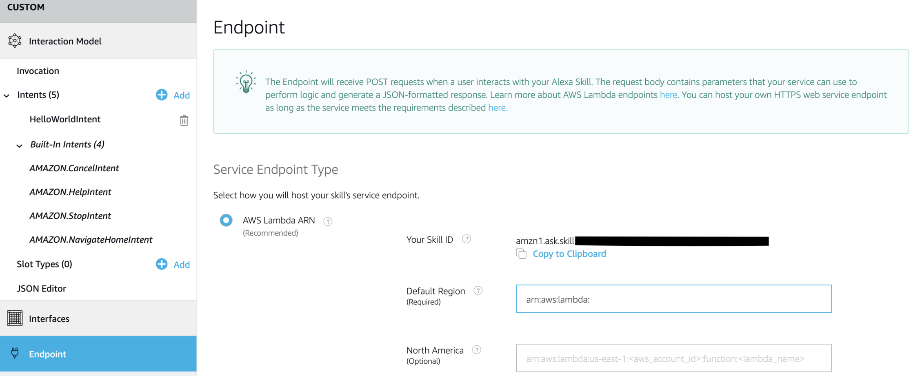

# Development of my first Alexa Skill: Reddit Notifer

Being an avid user of Reddit allowed me for always being in touch with the subjects that mattered most for me. For this reason, I wanted to develop an application that could easily update me whether new posts were submitted to my favorite subreddits, possibly without even touching my computer or phone. Since I already had an Echo Dot, it was the premise for developing my first Alexa Skill.

The main tasks required by my skill were:

* subreddit handling: insertion, deletion
* subreddit monitoring

With the model clear in my mind, I was ready to develop.

An Alexa skill is based on two components: Voice User Interface and Service Endpoint.

The Voice User Interface (VUI) is composed of the following elements:

* a set of intents that represent actions that users can do with your skill
* a set of utterances that are the words or phrases that users use to invoke the intents. Therefore, a mapping between intents and utterances is established. This mapping forms the interaction model for the skill
* an invocation name that identifies the skill

If the user invokes a particular intent, the VUI will make a POST request to the Service Endpoint with the request body containing the JSON that corresponds to the solicited intent. It's up to the Service Endpoint to process this data and generate a JSON-formatted response, which will be used by the VUI to respond through speech to the user.

# Voice User Interface
To be able to implement the VUI, I followed the following steps:

1. Access the [Alexa Developer Console](https://developer.amazon.com/alexa). After creating an Amazon Developer account, I signed in.


2. Select **Alexa Skills Kit**


3. Click the **Create Skill** button


4. Enter **Reddit Notifier** as Skill name and **Custom** as a model.


When I developed the skill there were only these options to choose from. Since then, a new option was introduced. When creating a skill, you can already select how you want to handle the Service Endpoint. You can choose whether to provide your own backend, or you can rely on the Alexa-Hosted option. Basically, the latter gives you an AWS Lambda endpoint, Amazon S3 media storage and a table for session persistence. The available resources are the same as the AWS Free Tier, so for a simple skill, it's very handy. You also get a code editor in the developer console, meaning that you have only one place where you can handle both main components of your skill.

While I find this addition very convenient, I also find it limiting:

* the only supported programming language is Node.js (version 8)
* you cannot work on the code on your local machine and upload it to the backend
* you don't get monitoring tools such as CloudWatch
* you cannot use other elements of the Free Tier

If you don't want to create an AWS account and you don't mind about what I mentioned, then this is the way to go!

## Interaction Model
The Interaction Model is the central part of the VUI. It contains the invocation name, intents, and utterances which are the key elements that allow a user to interact with your skill. Changing the invocation name is important when you want to give a different one based on the language. For English users, it's Reddit Notifier, while for Italian users I used Reddit Notifica.


The intents are the core part of the Voice User Interface. When a skill is created, four built-in intents are added by default, which are:

* `AMAZON.CancelIntent`
* `AMAZON.HelpIntent`
* `AMAZON.StopIntent`
* `AMAZON.NavigateHomeIntent`

They have built-in utterances, but you can add new ones.

The intents that I wanted my skill to support are:

* `SubredditInsertionIntent`
* `SingleSubredditDeletionIntent`
* `SubredditsMonitoringIntent`: check if any of the monitoring subreddits have been updated with new posts
* `SingleSubredditMonitoringIntent`: check if a particular subreddit has been updated with new posts
* `SubredditsListIntent`: list the subreddits that I'm currently monitoring
* `SingleSubredditLastPostsIntent`: this intent was added later since I also wanted to know **which** are the new posts submitted to a monitored subreddit

I started by manually creating a new intent.


Afterward, I proceeded with the creation of utterances for this newly created intent.


In order to retrieve the variable information in an utterance, slots are used. You can create a new slot when creating an intent, but the type for the slot has to be chosen from the ones offered by Amazon, be it `AMAZON.Actor`, `AMAZON.DATE`, `AMAZON.Food` and so on. This is needed so that the VUI can correctly detect what information the user wants to communicate. Since the subreddit category is not present, I initially tried with the type that allows for general information to be retrieved: `AMAZON.SearchQuery`. This type seemed like a good idea, but when actually using the intent, the Voice User Interface had difficulty in understanding what I was actually trying to say.

Therefore I created a custom slot type.


A custom slot type allows you to insert values that the VUI will use to better detect what the user wants to say. Unfortunately, it wasn't feasible to manually insert every active subreddit, so I created a Python script to retrieve the most common subreddits and generate the interaction model.

```python
LIMIT = 500000
counter = 0
URL = "https://www.reddit.com/subreddits.json?limit=100&after="
paging = "null"

data = requests.get("https://www.reddit.com/subreddits.json?limit=100&after=", headers = {'User-agent': 'your bot 0.1'}).json()

values = []
while counter < LIMIT:
    data = requests.get(URL + paging, headers = {'User-agent': 'your bot 0.1'}).json()

    for child in data["data"]["children"]:
        subreddit = child["data"]["url"].split("/r/")[1].strip('/')
        values.append({
            "name": {
                "value": subreddit
            }
        })
        counter += 1
        if(counter == LIMIT): break

    paging = data["data"]["after"]
    if(paging == None): break

print("Gathered {} subreddits!").format(str(counter))

```

The **JSON Editor** tab allows accessing the interaction model schema, which is a JSON file that contains all information regarding the interaction model, such as intents, utterances, slots and so on. This means that by generating programmatically the schema, I could build the interaction model.


# Service Endpoint
The **Endpoint** tab allows for selecting the Service Endpoint Type. You can choose between AWS Lambda or you own HTTPS web service. I found that the most straightforward and affordable way was the AWS Lambda option. To do so I had to create an Amazon Web Services account and choose the Free Tier option.


This option offers 1 Million free requests per month and 25 GB of Amazon DynamoDB storage, which is enough to store the relevant information for each user.

After I've created an AWS account, I created a Lambda service by inserting:

* redditNotifier: service name
* Python3.6: programming language used for the service
* `lambda_basic_dynamodb_execution`: this is a custom role that allows my Lambda service to access the DynamoDB service
* Ireland: an EU region that supports the Alexa Skills Kit trigger


The custom role can be created in the Services > IAM > Roles > Create Role. I chose to create a new policy that allows me to have access to CloudWatch and DynamoDB. This policy can be achieved by using the following JSON:

```
{
    "Version": "2012-10-17",
    "Statement": [
        {
            "Sid": "VisualEditor0",
            "Effect": "Allow",
            "Action": [
                "logs:CreateLogStream",
                "dynamodb:PutItem",
                "dynamodb:DeleteItem",
                "dynamodb:GetItem",
                "dynamodb:Scan",
                "dynamodb:Query",
                "dynamodb:UpdateItem",
                "logs:CreateLogGroup",
                "logs:PutLogEvents"
            ],
            "Resource": "*"
        }
    ]
}
```
To successfully configure the Service Endpoint, I had to connect it to the Voice User Interface. To do this you have to:

* add the Alexa Skills Kit in the Add triggers section


* copy the Skill ID of the Alexa skill (you can find it in the Alexa Skills section) into the Configure triggers section


* copy the Amazon Resource Name (ARN) displayed in the upper-right corner of the Lambda Service into the **Endpoints** tab of the Alexa Developers Console



After this lengthy process, I was finally ready to code my backend. The Lambda Service has a built-in code editor, which can be useful for quick changes, but the reasons that I didn't choose the Alexa-hosted option for the service endpoint were:

* not be limited to Node.js since I prefer Python
* be able to work on the code on my own code editor and not on the one offered in the browser

The backend uses the [ASK SDK for Python](https://github.com/alexa/alexa-skills-kit-sdk-for-python) for development, which provides many examples useful for understanding the elements needed for building the service endpoint. Basically, the AWS Lambda function receives an input, which is called a Request and returns an output, which is a Response. Communication with the Voice Interface is done through JSON objects. A Request is usually:

* a LaunchRequest: this request is sent when the user initially invokes the skill through its invocation name

```python
@sb.request_handler(can_handle_func=is_request_type("LaunchRequest"))
def launch_request_handler(handler_input):
    """Handler for Skill Launch."""
    # type: (HandlerInput) -> Response
    
    handler_input.response_builder.set_should_end_session(False)

    handler_input.response_builder.speak(lang.WELCOME_TEXT).ask(lang.WELCOME_REPROMPT_TEXT)
    return handler_input.response_builder.response
```

* an IntentRequest: this is the main method of communication between the intents of the VUI and the logic of the backend
* a SessionEndedRequest: this request signals to the Endpoint Service that the user has finished using the skill

```python
@sb.request_handler(can_handle_func=is_request_type("SessionEndedRequest"))
def session_ended_request_handler(handler_input):
    """Handler for Session End."""
    # type: (HandlerInput) -> Response
    
    return handler_input.response_builder.speak(lang.GOODBYE_TEXT).response
```

A Request contains also other relevant information, such as:

* USER_ID: this will be used to anonymously identify a user
* LOCALE: this is used to distinguish whether the user prefers the English or Italian version of the skill

```python
@sb.global_request_interceptor()
def log_request(handler_input):
    """Log request to alexa service."""
    # type: (HandlerInput) -> None
    print("Alexa Request: {}\n".format(handler_input.request_envelope.request))
    
    request_locale = handler_input.request_envelope.request.locale
    global lang
    if(request_locale == 'it-IT'):
        lang = lang_IT
    else:
        lang = lang_US
```

Three elements distinguish the Response offered by the Endpoint Service:

* a **speech** element: the main message that the Alexa device will respond to the intent
* a **reprompt** element: the message that the Alexa device will offer if the user doesn't interact with the skill for 8 seconds
* a **card** element: used to visualize the message on devices that have a display

Proper modularity allowed me for dividing the code base into three main sections:

* `lambda_function.py`: the main functions that have a one-to-one mapping with the intents of the Voice Interface
* `utils.py`: useful functions such as encoders, converters
* `redditNotifier_en_US.py`/`redditNotifier_it_IT.py`: files that contain the speech/reprompt elements used for the output

Doing a typical use case of the skill and highlighting the relevant parts of what happens in the backend will give proper insight.

The activation of the skill is handled by the `launch_request_handler` which simply greets the user. If the user doesn't interact with the skill, the skill further seeks interaction. If no answer is given, then the skill ends its lifetime. This is valid for each `request_handler`. The user has the possibility to ask for guidance, in which case he will receive a helping message. Typically the first IntentRequest done by the user is `SubredditInsertionIntent`.

To be able to store the subreddit that the user wants to monitor, I create an entry in a table of DynamoDB, a NoSQL service offered by AWS in the FreeTier. This entry is made of:

* USER_ID: primary key
* subreddit
* subreddit_hash: an element that allows checking whether new posts have been submitted to that subreddit

The subreddit hash is generated by hashing the timestamp of the latest 5 posts added on the subreddit chosen by the user. If a new post is submitted, this hash will be different as soon as the user asks to check the subreddit, otherwise, the hash will be the same.

```python
subreddit_rss = feedparser.parse("https://www.reddit.com/r/" + chosen_subreddit + "/.rss")
if(not subreddit_rss.has_key('entries') or len(subreddit_rss.entries) == 0): raise TypeError

to_hash = ""
entries_length = len(subreddit_rss.entries)
        
for index in range(LIMIT):
    if index < entries_length:
        to_hash += subreddit_rss.entries[index].updated

subreddit_hash = str(hashlib.md5( (to_hash).encode('utf-8') ).hexdigest())

response = table.put_item(
    Item={
        'user': user_id,
        'subreddit': chosen_subreddit,
        'subreddit_hash': subreddit_hash
    }
)
```

If the user wants to remove the newly entered subreddit, it's enough to remove it from the database, as long as it has been previously inserted. If this is not the case, I communicate it to the user. One important fact when building voice-oriented skills is to guide the answer in properly using your skill.

If the user checks whether new posts have been submitted to his subreddit, then it's enough to control if the stored hash corresponds to the hash of the timestamps of the most recent posts. If the subreddit has been updated, then also the table is to be updated with the new hash value.

```
response = table.update_item(
    Key={
        'user': userID,
        'subreddit':subreddit
    },
    UpdateExpression="set subreddit_hash = :sh",
    ExpressionAttributeValues={
        ':sh': new_subreddit_hash
    },
    ReturnValues="UPDATED_NEW"
)
```

This check can also be done iteratively for all monitor subreddits, thus giving to the user the list of the ones that got new posts.

Finally, the user can also ask for the latest posts on any subreddit.


# Conclusion
Developing an Alexa skill not only helped me in better understanding the mechanisms of the Alexa development cycle and some elements of the AWS infrastructure (Lambda, DynamoDB, permissions) but also pushed me to improve the human-computer interaction. To create a good user experience, I had to do my best in instructing and guiding the user in how to properly use Reddit Notifier and I'm still learning how to improve!

## Credits
This project was made by Alexandru Daniel Tufa, an MSc in Engineering in Computer Science at Sapienza University of Rome. For any doubts, questions or remarks, feel free to email me at alex.tufa94@gmail.com.
